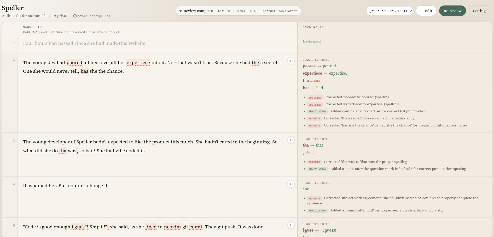
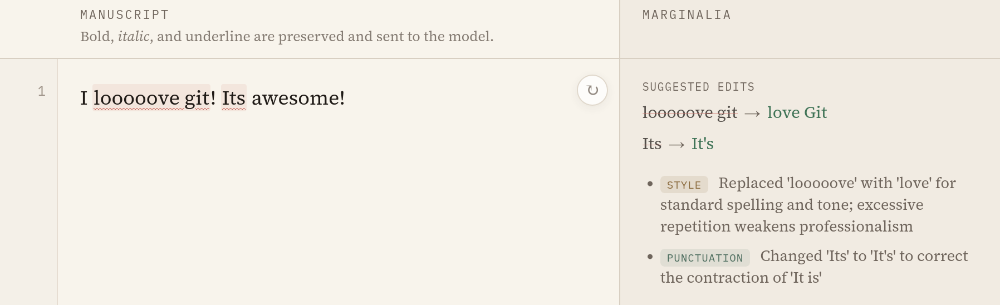

<div align="center">

# Speller

**A local AI grammar checker for authors — paste, review, keep your voice.**

[](https://github.com/StoneLabs/Speller)
[](#quick-start)

[Features](#features) •
[Quick start](#quick-start) •
[Development](#development) •
[Settings](#settings) •
[Contributors](#contributors)

</div>





Speller helps you proofread long-form writing on your own hardware. Paste from Word or LibreOffice, run a paragraph-by-paragraph review, and read suggestions as underlines and notes in the margin — without sending your manuscript to the cloud.

## Features

* **Rich paste**: **bold**, *italic*, and underline survive from your word processor and are sent to the model
* **Write, then review**: Copy from your favorite editor, then review line by line
* **Reliable diffs**: see the corrections highlighted on the left, details on the right
* **Focus on what matters**: Only lines that need corrections are bold. Everything else fades into the background
* **Your model, your machine**: Any OpenAI-compatible API (Ollama, LM Studio, vLLM, …)
* **Docker-ready**: one command deploy with integrated model running on your own hardware!

## Quick start

You need [Git](https://git-scm.com), [Docker](https://docs.docker.com/get-docker/), and [Docker Compose](https://docs.docker.com/compose/). For the bundled Ollama service, an NVIDIA GPU and the [NVIDIA Container Toolkit](https://docs.nvidia.com/datacenter/cloud-native/container-toolkit/install-guide.html) are recommended.

```bash
# Clone the repository
git clone https://github.com/StoneLabs/Speller.git
cd Speller

# Build and start Speller + Ollama (first run downloads the model — be patient)
docker compose up --build
```

Open **http://localhost:8000** in your browser.

On first start, `ollama-pull` downloads `alibayram/Qwen3-30B-A3B-Instruct-2507`. The API URL is pre-filled for Docker. Open **Settings → Refresh** to load models once the download finishes.

> **Note**
> Depending on your system you might need to adjust the default model at the top of the file. I had great success with this one but it required a good amount of VRAM...

### Environment variables (no changes needed for simple deployment)

| Variable | Default | Description |
|----------|---------|-------------|
| `SPELLER_PORT` | `8000` | Host port for the web UI |
| `SPELLER_LLM_API_BASE` | `http://ollama:11434` | LLM API URL (Docker network) |

## Development

For hot reload without Docker:

```bash
./dev.sh
```

Then open **http://localhost:5173**. Set your LLM URL under **Settings** (e.g. `http://localhost:11434` for a local Ollama instance).

Or run backend and frontend separately:

```bash
# Terminal 1 — backend
cd backend
python -m venv .venv && source .venv/bin/activate
pip install -r requirements.txt
uvicorn main:app --reload --host 0.0.0.0 --port 8000

# Terminal 2 — frontend
cd frontend
npm install && npm run dev
```

### Strictness setting

1. **Strict** — typos and clear grammar errors only
2. **Balanced** — above plus minor style fixes *(default)*
3. **Editor** — thorough editing suggestions

## Stack

- **Backend:** Python, FastAPI, httpx, Jinja2
- **Frontend:** Vue 3, Vite
- **Optional LLM:** Ollama (included in `docker-compose.yml`)

## Contributors

You can add yourself here after contributing something!

<a href="https://github.com/StoneLabs"></a>

## About AI authored PR's and code

I vibe coded some parts of this app. The code is clean enough to work with but not great overall. Any PR will be rejected if you didn't check the code quality.

Please disclose AI authored PRs. They will not be rejected just for that. Human refactors of the codebase are very welcome!

---

<div align="center">

**[StoneLabs/Speller](https://github.com/StoneLabs/Speller)**

</div>
